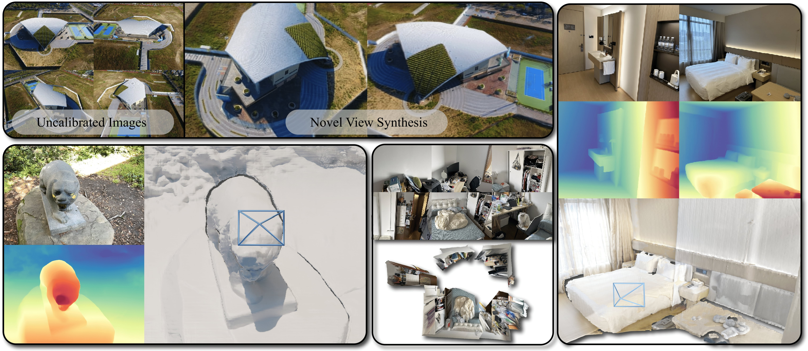

# FLARE: Feed-forward Geometry, Appearance and Camera Estimation from Uncalibrated Sparse Views
[](https://zhanghe3z.github.io/FLARE/)
[](https://huggingface.co/zhang3z/FLARE)
[](https://zhanghe3z.github.io/FLARE/videos/teaser_video.mp4)

Official implementation of **FLARE** (arXiv 2025) - a feed-forward model for joint camera pose estimation, 3D reconstruction and novel view synthesis from sparse uncalibrated views.



## 📖 Overview
We present FLARE, a feed-forward model that simultaneously estimates high-quality camera poses, 3D geometry, and appearance from as few as 2-8 uncalibrated images. Our cascaded learning paradigm:

1. **Camera Pose Estimation**: Serves as the geometric foundation
2. **Geometry Reconstruction**: Builds camera-centric 3D structure
3. **Appearance Modeling**: Enables photorealistic novel view synthesis via 3D Gaussians

Achieves SOTA performance with inference times <0.5 seconds!

## 🛠️ TODO List
- [x] Release point cloud and camera pose estimation code. The code will be released immediately after passing the company review!
- [ ] Release novel view synthesis code. (~2 weeks)
- [ ] Release evaluation code. (~2 weeks)
- [ ] Release training code.

## 🌍 Installation

```
conda create -n flare python=3.8
conda activate flare 
conda install pytorch torchvision pytorch-cuda=12.1 -c pytorch -c nvidia  # use the correct version of cuda for your system
pip install -r requirements.txt
```

## 🎯 Run a Demo (Point Cloud and Camera Pose Estimation)


```
sh run_pose_pointcloud.sh
```


## 📜 Citation
```bibtex
@misc{zhang2025flare,
  title={FLARE: Feed-forward Geometry, Appearance and Camera Estimation from Uncalibrated Sparse Views},
  author={Zhang, Shangzhan and Wang, Jianyuan and Xu, Yinghao and Xue, Nan and Rupprecht, Christian and Zhou, Xiaowei and Shen, Yujun and Wetzstein, Gordon},
  year={2025},
  eprint={},
  archivePrefix={arXiv},
  primaryClass={cs.CV}
}